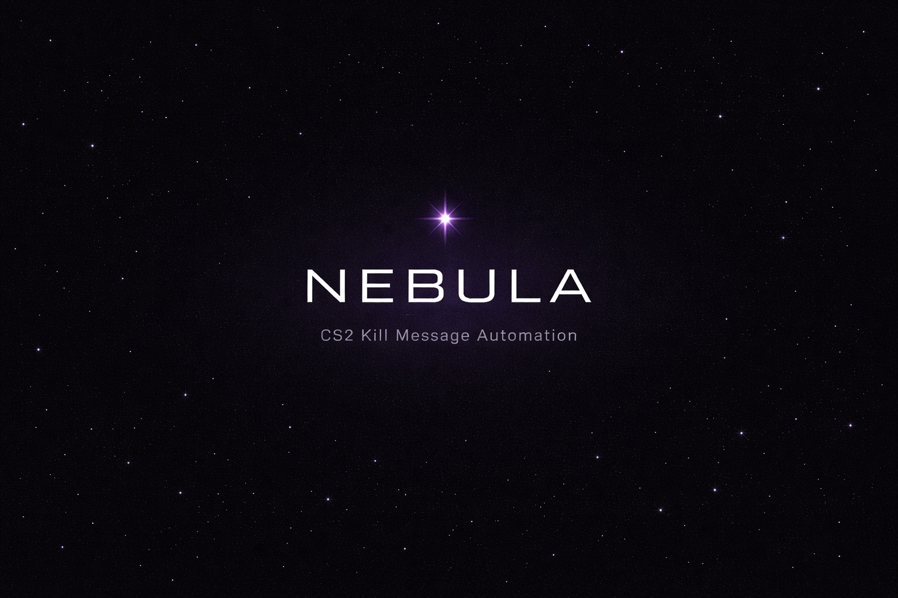
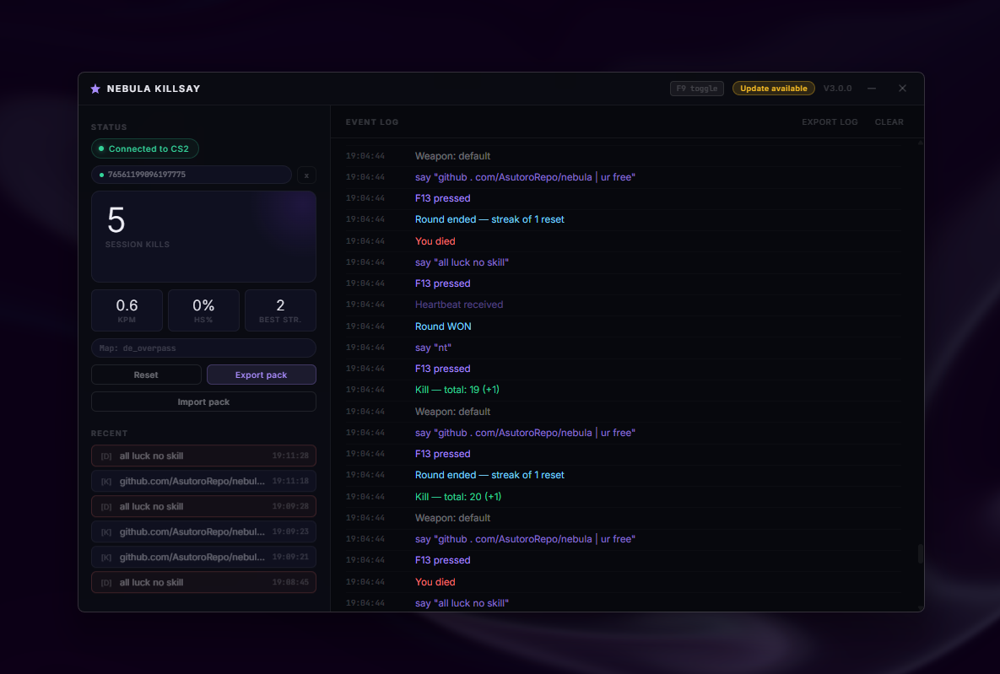

<div align="center">



# ✦ Nebula Killsay

**Automatic CS2 kill message automation. Zero effort. Maximum impact.**

[](https://github.com/yourusername/nebula/releases)
[](https://github.com/yourusername/nebula/releases)
[](https://www.counter-strike.net/)
[](LICENSE)

[**Download**](https://github.com/yourusername/nebula/releases/latest) · [**Get Pro**](https://nebula-killsay.lovable.app) · [**Discord (WIP)**]() · [**Changelog**](CHANGELOG.md)



</div>

---

## What is Nebula Killsay?

Nebula Killsay hooks into CS2's **Game State Integration (GSI)** — Valve's official data API — to detect kills, streaks, deaths, and round events in real time, then automatically fires your custom messages into chat via a `.cfg` bind. No injections, no cheats, fully VAC safe.

---

## Features

| Feature | Free | Pro |
|---|:---:|:---:|
| Custom kill messages | ✓ | ✓ |
| Per-weapon messages (knife, AWP, pistol, grenade, Zeus) | ✓ | ✓ |
| Kill streak detection & escalatng messages | ✓ | ✓ |
| Death & round win/loss messages | ✓ | ✓ |
| Message variables `{weapon}` `{streak}` `{kills}` `{map}` `{hs}` | ✓ | ✓ |
| Message randomiser (comma-sep or multi-line) | ✓ | ✓ |
| Session stats — KPM, HS%, best streak | ✓ | ✓ |
| Kill history feed | ✓ | ✓ |
| F9 global hotkey toggle | ✓ | ✓ |
| UI themes (Nebula, Crimson, Arctic, Midnight) | ✓ | ✓ |
| System tray minimise | ✓ | ✓ |
| Auto GSI setup wizard | ✓ | ✓ |
| Per-map message overrides | ✗ | ✓ |
| Milestone kill messages | ✗ | ✓ |
| Message pack import / export | ✗ | ✓ |
| Match-end promotion message | shown | removed |

> **[Get Pro →](https://nebula-killsay.lovable.app)** — one-time purchase, no subscription.

---

## Installation

### Option A — Download the release (recommended)

1. Go to [**Releases**](https://github.com/yourusername/nebula/releases/latest) and download `Nebula.exe`
2. Run it — no install needed, single executable
3. Follow the **Setup** tab inside the app to configure CS2

### Option B — Run from source

**Requirements:** Python 3.10+, Windows 10/11

```bash
git clone https://github.com/AsutoroRepo/nebula.git
cd nebula
pip install -r requirements.txt
python nebula.py
```

### Build the exe yourself

```bash
pip install pyinstaller
build.bat
```

The exe will appear in `dist/Nebula.exe`.

---

## CS2 Setup

Nebula Killsay uses CS2's Game State Integration. The **Setup tab** inside the app handles this automatically, but here's what it does manually:

1. **GSI config** — creates `gamestate_integration_nebula.cfg` in your CS2 `cfg` folder, which tells CS2 to push game data to the app
2. **Kill bind** — add this to your CS2 `autoexec.cfg`:
   ```
   bind "F13" "say_team placeholder"
   ```
   The app rewrites the bind content dynamically on each kill.
3. Launch CS2, load a match, and watch the status indicator turn green.

---

## Message Variables

Use these anywhere in your messages:

| Variable | Replaced with |
|---|---|
| `{weapon}` | Weapon display name (e.g. `AWP`, `Knife`) |
| `{streak}` | Current kill streak count |
| `{kills}` | Total session kills |
| `{map}` | Current map name |
| `{hs}` | `HS` if headshot, blank otherwise |

**Examples:**
```
{weapon} diff
x{streak} and they're still queueing
{hs} btw
```

---

## Pro License

After purchasing at [nebula.best](https://nebula.best), you'll receive a license key. Enter it in the **Pro** tab inside the app to unlock all features and remove the match-end promotion.

Keys are tied to your machine. If you need to transfer to a new PC, contact support.

---

## FAQ

**Is this VAC safe?**
Yes. Nebula Killsay uses Valve's official GSI API and simulates keypresses — the same way any macro or config script does. It does not read or write game memory.

**Does it work in Competitive / Premier?**
Yes — all modes that support say/say_team binds.

**Why F13? My keyboard doesn't have that.**
F13 is a virtual key that CS2 recognises but is invisible to players in-game — it never conflicts with your actual binds. The app handles it automatically via Windows API.

**The status indicator stays grey.**
Make sure CS2 is running and you're loaded into a match (not the main menu). Also verify the GSI file was written correctly via the Setup tab.

**Messages aren't firing.**
Check the CFG path in the Config tab matches your actual CS2 `cfg` folder. Run the Setup wizard again if unsure.

---

## Contributing

See [CONTRIBUTING.md](CONTRIBUTING.md) — bug reports and feature suggestions are welcome. Pull requests are reviewed case by case.

---

## License

Source available — see [LICENSE](LICENSE). Free to use personally. Redistribution, resale, and removal of license checks are not permitted.

---

<div align="center">
<sub>Built with ✦ by <a href="https://nebula.best">nebula.best</a></sub>
</div>
